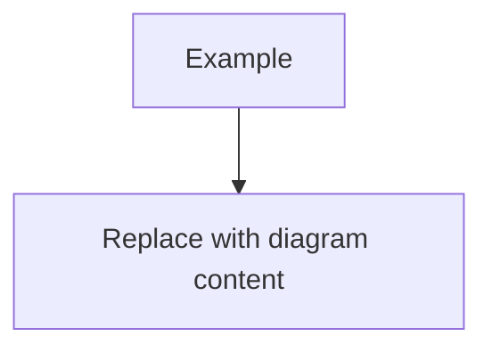

# Database visualization guide

This folder contains schema-only documentation and diagrams for QazPostWeb.

## Files

- `SCHEMA_OVERVIEW.md` - human-readable database overview.
- `qazpost_erd.dbml` - DBML diagram for dbdiagram.io.
- `qazpost_erd.mmd` - Mermaid ER diagram.
- `qazpost_business_flow.mmd` - smaller Mermaid business-flow diagram.
- `barcode_schema.sql` - schema-only PostgreSQL dump used as the source input.

## Open the DBML diagram in dbdiagram.io

1. Go to <https://dbdiagram.io/>.
2. Create a new diagram.
3. Copy the full contents of `docs/database/qazpost_erd.dbml`.
4. Paste it into the DBML editor.
5. Let dbdiagram.io render the ERD.

Recommended use:

- Export a PNG/SVG for project presentations.
- Keep `qazpost_erd.dbml` in git as the editable source.
- Refresh it after database migrations that add, remove, or rename tables/columns.

## Open the Mermaid ERD

You can open `docs/database/qazpost_erd.mmd` in:

- Mermaid Live Editor: <https://mermaid.live/>
- Markdown preview tools that support Mermaid.
- Documentation platforms such as GitLab, GitHub-compatible renderers, or MkDocs with Mermaid support.

Steps for Mermaid Live Editor:

1. Open <https://mermaid.live/>.
2. Copy the contents of `docs/database/qazpost_erd.mmd`.
3. Paste it into the editor.
4. Export SVG/PNG if needed.

## Open the business-flow diagram

Use the same Mermaid tools for `docs/database/qazpost_business_flow.mmd`.

This diagram is intentionally smaller than the full ERD. It is better for README files, onboarding, and explaining the SHPI workflow:

- department hierarchy;
- user department scope;
- range request approval;
- fixed `barcode_ranges.region_code`;
- counter allocation by `(package_type, region_code)`;
- generated barcode rows;
- audit logging.

## Use diagrams in README or presentations

For a README or internal documentation page, prefer:

- `qazpost_business_flow.mmd` for business explanation;
- `qazpost_erd.mmd` for developer onboarding;
- exported `qazpost_erd.dbml` image for presentations.

If the Markdown renderer supports Mermaid, embed a diagram like this:

```markdown

```

If the renderer does not support Mermaid, export the diagram to SVG/PNG and link the image from the README.

## Security note

These visualization files must remain schema-only.

Do not add:

- real database rows;
- `.env` content;
- `DATABASE_URL`;
- passwords;
- `SECRET_KEY`;
- `KEYCLOAK_CLIENT_SECRET`;
- tokens or API keys.

